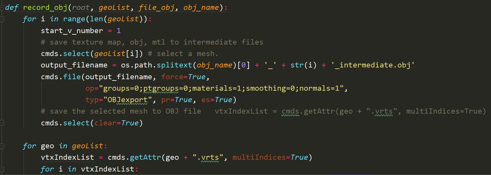
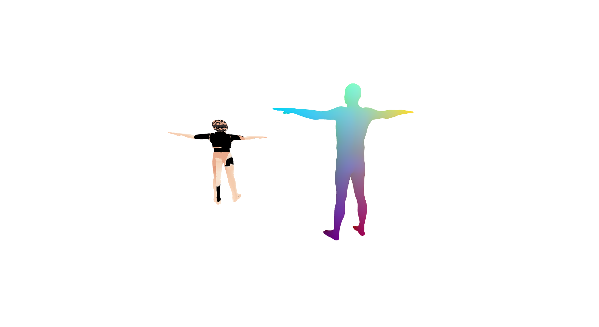

# Pose2Carton 

EE228 课程大作业，利用3D骨架控制3D卡通人物。


# Maya 环境配置

在windows环境下配置maya

- 从https://www.autodesk.com/education/edu-software 上下载Autodesk_Maya_2020_ML_Windows_64bit_di_en-US_setup_webinstall并运行

- 将~\Maya2020\bin加入到环境变量
- 安装pip
```
curl https://bootstrap.pypa.io/pip/2.7/get-pip.py -o get-pip.py
mayapy get-pip.py
```

- 安装numpy
```
mayapy -m pip install -i https://pypi.anaconda.org/carlkl/simple numpy
```

# 匹配流程

- 在transfer.py中输入字典序列manual_model_to_smpl{}，里面是选用模型和给定的SMPL模型的关节点的匹配
- transfer.py首先调用transfer_one_sequence(infofile, seqfile）函数，，它有2个输入参数，infofile是filename.fbx对应的filename.txt文件，filename.txt文件一开始每一行是关节点信息，中间部分每一行是蒙皮信息，最后一部分是层次信息。而seqfile就是选择的info_seq_5.pkl文件， 其中保存的是所有帧的旋转矩阵。
- 调用transfer_one_sequence时首先提取逐帧旋转矩阵human_pose， 并将human_pose和filename.txt文件传入transfer_given_pose函数得到outmesh。
- 在transfer_given_pose函数中， 第一步先读取filename.txt中的层次结构，建立关节点名称到索引的映射，建立动力学结构。然后重新组织映射，确保每条运动链上索引递增。
- 第二步则是从filename.txt中解析出蒙皮权重， 表征为 J x V 的矩阵, J是关节点数，而V是顶点数，同时读取filename.txt中以“joints”开头的关节点信息， 从中解析出T-posed的卡通人物骨架，表现为J x 3的张量，即每一个关节点的空间坐标。
- 第三步是利用正向运动学将T姿势骨架转化为姿势化的角色骨架。
- 最后，根据第二步中解析得到的蒙皮权重和第三步得到的骨架生成混合权值，从骨架得到mesh。


# 新增脚本说明

- 由于可视化可能时间过长且中间容易断掉，造成视频无法生成，在vis.py中添加 
```
if (idx==150) or (idx==300):
        compose_video()
```
分别在生成150张图片、300张图片、全跑完时生成一次视频，确保不因中间断掉而没有视频。

- 由于从网上下载模型可能存在多个mesh，导致运行原代码会生成一些缺少“部位”的obj文件。所以我们对fbx_parser.py中的record_obj 函数进行如下改进，使之能够生成各mesh对应的mtl和obj文件

geoList列表记录了mesh信息，通过循环访问，可以遍历所有mesh，并以不同的文件名生成。之后可以通过blender软件读入生成的各个obj文件，将多个mesh合并，再导出为一个包含所有mesh的mtl和obj文件。


# 项目结果

这里放置来自你最终匹配结果的截图， 如





# 协议 
本项目在 Apache-2.0 协议下开源

所涉及代码及数据的最终解释权归倪冰冰老师课题组所有

Group 5
